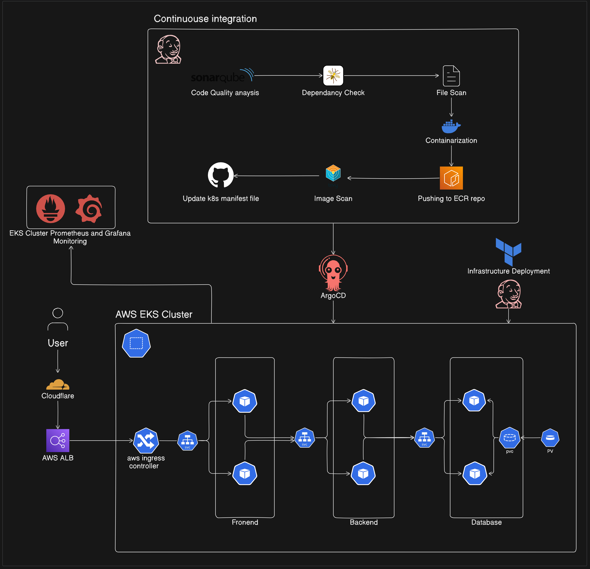

# E2E-Kubernetes-Three-Tier

This project demonstrates the implementation of DevOps deployment of three tier web application on AWS EKS cluster. Variouse DevOps tools and technologies have been used to setup the project.
Jenkins has been used to configure the continuous integration part which would update docker image and update k8s manifest files.
ArgoCD has been used for the continuous deployment on Kubernetes cluster.

## Architecture

## Application Code
The `application_code` directory contains the source code for the Three-Tier Web Application.

## Jenkins Pipeline Code
In the `jenkins_pipeline` directory, you'll find Jenkins pipeline scripts. These scripts automate the CI/CD process, ensuring smooth integration and deployment of your application.

## Kubernetes Manifests Files
The `kubernetes_manifests_files` directory holds Kubernetes manifests for deploying your application on AWS EKS.

**TechStack**:

- Terraform
- EKS Kubernentes
- Jenkins CI
- ArgoCD GitOps
- Docker
- ECR Private Repo
- Prometheus/Grafana
- SonarQube
- Trivy
- Owasp
- CloudFlare DNS
- Linux
- MongoDB
- GitHub 